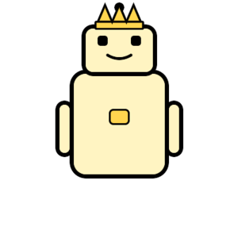

# 🤖 Robot On-Chain NFT Collection

A fully **on-chain SVG NFT** collection deployed on **Ethereum Sepolia**.  
Every Robot’s metadata and image live entirely on-chain — no IPFS, no servers, no gateways.

---

The files below are extracted directly from the on-chain metadata for preview purposes.

<p align="center">
  
  
  
  
  
</p>


---

This project demonstrates how to build production-grade, gas-efficient, immutable NFTs using:

- Pure Solidity SVG generation  
- Base64-encoded JSON metadata  
- A dedicated on-chain SVG storage contract  
- Deterministic token → art mapping  
- Foundry for scripting, testing, and deployment  

---

## 🔗 Live Contracts (Sepolia)

### Robot NFT (ERC721)
```

0x37B38ed26cD551C0A2C1c96A2Cf106E8D080e0e0

```
Explorer:  
https://sepolia.etherscan.io/address/0x37B38ed26cD551C0A2C1c96A2Cf106E8D080e0e0

### SVG Store
```

0x8f00e9946cFBec7516926aCd1638e5Ff96c26Cdf

```
Explorer:  
https://sepolia.etherscan.io/address/0x8f00e9946cFBec7516926aCd1638e5Ff96c26Cdf

---

## 🧠 Architecture

```

┌───────────────┐
│   RobotNft    │
│  (ERC721)     │
│               │
│ tokenURI() ───┼──► JSON (on-chain)
│               │        └─ image: data:image/svg+xml;base64,...
│               │
│ tokenToSvgIdx │
└───────┬───────┘
│
▼
┌──────────────────┐
│ RobotSvgsStore   │
│ (on-chain SVGs)  │
│                  │
│ getSvg(index)    │
└──────────────────┘

````

- `RobotNft` mints tokens and stores:
  - owner
  - `tokenId → svgIndex`
- `RobotSvgsStore` holds a library of base SVG templates.
- `tokenURI()` builds **JSON + SVG entirely on-chain**, encodes it in Base64, and returns a `data:` URI.

No external dependencies. No mutable off-chain state.

---

## 🧩 Byte-Size Optimization Strategy

Storing full SVGs per NFT is expensive. This project solves that by:

1. **Separating concerns**
   - `RobotSvgsStore` holds reusable SVG templates.
   - `RobotNft` only stores a small `uint256 svgIndex`.

2. **Reusing art**
   - Many tokens can reference the same SVG.
   - Only *indices* are stored per token.

3. **Dynamic Assembly**
   - Metadata is constructed in-memory in `tokenURI()`.
   - SVG is fetched from `RobotSvgsStore`.
   - JSON is built and Base64-encoded on the fly.

This reduces:
- Storage writes  
- Deployment cost  
- Mint gas  
- Long-term chain bloat  

While still being **100% on-chain**.

---

## 🖼 What “Fully On-Chain” Means

Each token returns:

```json
{
  "name": "Robot #1",
  "description": "A robot NFT",
  "image": "data:image/svg+xml;base64,PHN2ZyB3aWR0aD0nMjAwJyBoZW..."
}
````

The browser or marketplace decodes it directly from the blockchain.

There is **no**:

* IPFS
* Arweave
* CDN
* API
* Gateway

If Ethereum exists, your NFT exists.

---

## ⚙️ Core Features

* ERC721 compliant
* On-chain SVG rendering
* Deterministic art mapping
* Gas-optimized storage
* Owner-controlled minting
* Production-ready errors & events
* Foundry-based deployment

---

## 📈 Pros & Cons of On-Chain NFTs

### ✅ Pros

* Permanent & censorship-resistant
* Zero external dependencies
* Immune to broken links
* Trust-minimized
* Ideal for generative art
* True decentralization

### ⚠️ Cons

* Higher deployment cost
* Limited by EVM gas constraints
* Complex string manipulation
* Large art sets can become expensive

This architecture balances both worlds by reusing SVGs and storing only indices per token.

---

## 🧪 Local Setup

### Install Foundry

```bash
curl -L https://foundry.paradigm.xyz | bash
foundryup
```

### Clone & Install

```bash
git clone https://github.com/terymoney/Onchain-NFTs.git
cd Onchain-NFTs
forge install
```

### Run Tests

```bash
forge test -vv
forge coverage
```

---

## 🚀 Deployment

Create a `.env` file:

```bash
SEPOLIA_RPC_URL=your_rpc_url
PRIVATE_KEY=your_private_key
ETHERSCAN_API_KEY=your_etherscan_key
```

Deploy:

```bash
forge script script/DeployRobotNft.s.sol:DeployRobotNft \
  --rpc-url $SEPOLIA_RPC_URL \
  --private-key $PRIVATE_KEY \
  --broadcast \
  --verify \
  --etherscan-api-key $ETHERSCAN_API_KEY \
  -vvvv
```

Mint robots:

```bash
forge script script/MintRobotNft.s.sol:MintRobotNft \
  --rpc-url $SEPOLIA_RPC_URL \
  --private-key $PRIVATE_KEY \
  --broadcast
```

---

## 🛠 Useful Commands

### Inspect ownership

```bash
cast call --rpc-url $SEPOLIA_RPC_URL $ROBOT_NFT "ownerOf(uint256)(address)" 1
```

### Decode token metadata

```bash
cast call --rpc-url $SEPOLIA_RPC_URL $ROBOT_NFT "tokenURI(uint256)(string)" 1 \
| sed 's/^"//; s/"$//' \
| sed 's/^data:application\/json;base64,//' \
| base64 -d
```

### Extract SVG to file

```bash
cast call --rpc-url "$SEPOLIA_RPC_URL" "$ROBOT_NFT" "tokenURI(uint256)(string)" 1 \
| sed 's/^"//; s/"$//' \
| sed 's/^data:application\/json;base64,//' \
| base64 -d \
| sed -n 's/.*"image":"data:image\/svg+xml;base64,\([^"]*\)".*/\1/p' \
| base64 -d > robot1.svg
```

---

## 🎯 Why This Project Matters

This project demonstrates:

* Deep understanding of ERC721 internals
* Advanced string & byte manipulation in Solidity
* On-chain art architecture
* Gas-aware design
* Production deployment using Foundry

It’s not a “mint from IPFS” NFT.
It’s a **protocol-grade on-chain asset system**.

Perfect for portfolios, audits, and serious Web3 engineering roles.

---

## 🧑‍💻 Author

**Maria Terese Ezeobi**
Smart Contract Developer
Solidity • Foundry • On-Chain Systems

```
